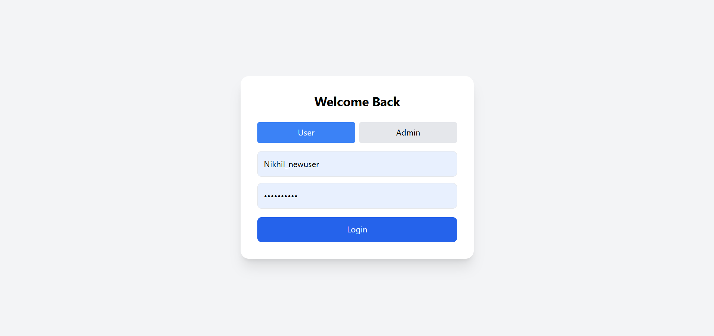
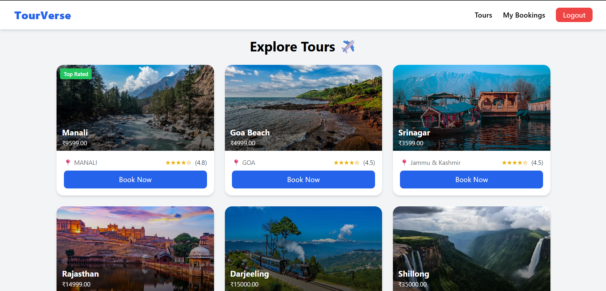
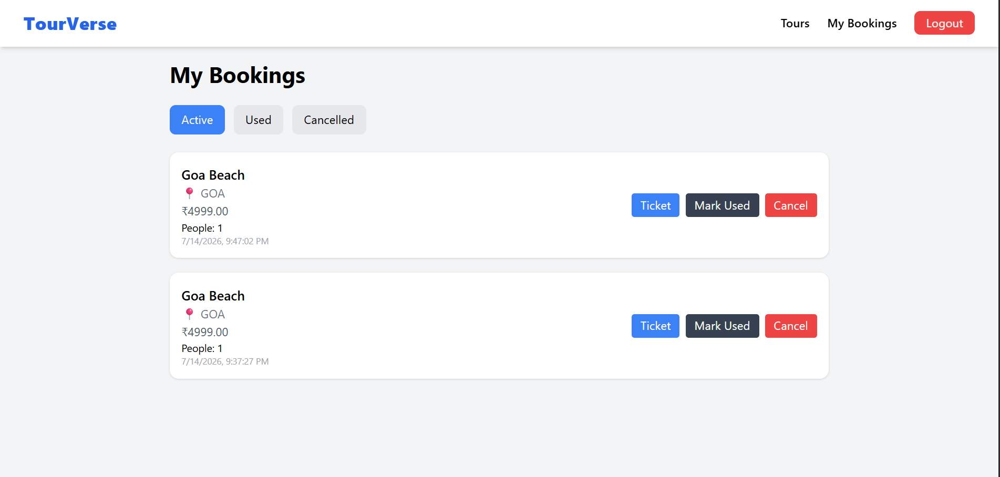
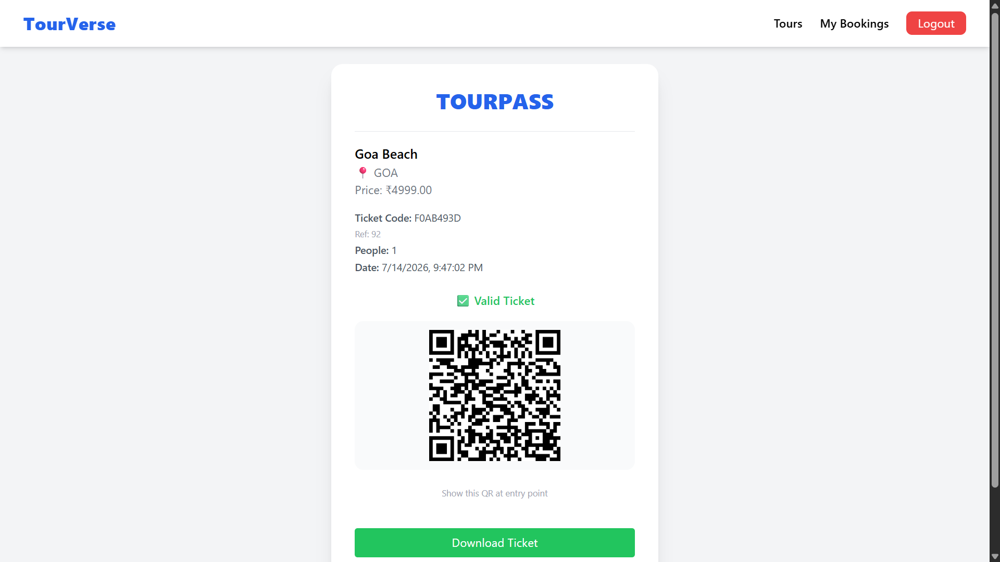
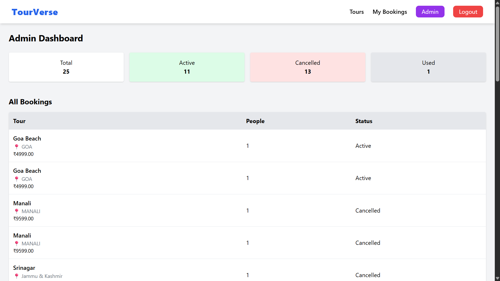

# TourVerse

A full-stack tour booking platform built using *React, **Django REST Framework, and **JWT Authentication*. TourVerse enables users to browse tour packages, book tours, generate QR-based digital tickets, and manage their bookings through a responsive web interface. The application also provides an administrator portal for secure QR ticket verification and booking management.

---

# Overview

TourVerse was developed as a full-stack web application to demonstrate modern web development concepts using a client-server architecture. The frontend communicates with the backend through REST APIs, while JWT-based authentication provides secure access for both users and administrators.

The project focuses on solving a real-world booking workflow by implementing authentication, tour management, booking operations, QR code ticket generation, and role-based access control.

---

# Features

### User

- Secure User Authentication (JWT)
- Browse Available Tour Packages
- Book Tour Packages
- View Booking History
- Cancel Bookings
- Download QR-Based Digital Tickets

### Administrator

- Secure Admin Login
- QR Code Ticket Verification
- Mark Tickets as Used
- Booking Management

---

# Technologies Used

## Frontend

- React
- Vite
- Tailwind CSS
- Axios
- React Router DOM

## Backend

- Django
- Django REST Framework
- Simple JWT

## Database

- SQLite

## Tools

- Git
- GitHub
- Visual Studio Code
- npm

---

# Project Architecture

React Frontend
       │
 REST API Communication
       │
Django REST Framework
       │
    SQLite Database

---

# Project Structure

tour_booking/
│
├── frontend/
│   ├── src/
│   ├── public/
│   └── package.json
│
├── backend/
│   ├── backend/
│   ├── bookings/
│   ├── users/
│   └── manage.py
│
└── requirements.txt

---

# Screenshots

### Login Page

### Tour Listing

### My Bookings

### Digital Ticket

### Admin Dashboard

---

# Skills Demonstrated

- Full Stack Web Development
- REST API Development
- JWT Authentication
- CRUD Operations
- React Component-Based Development
- API Integration
- QR Code Generation & Verification
- Role-Based Access Control
- Git & GitHub Version Control

---

# Challenges & Learnings

During the development of TourVerse, I gained practical experience in designing REST APIs, implementing secure JWT authentication, integrating a React frontend with a Django backend, and managing complete booking workflows. Building QR-based ticket generation and verification also strengthened my understanding of real-world application development and backend integration.

---

# Future Improvements

- Online Payment Integration
- Email Notifications
- Tour Reviews & Ratings
- Advanced Search & Filters
- PostgreSQL Migration
- Cloud Deployment
- Responsive Mobile Optimization

---

# Author

*Nikhil Nandan*

GitHub: **github.com/nikhilnandan-dev**
